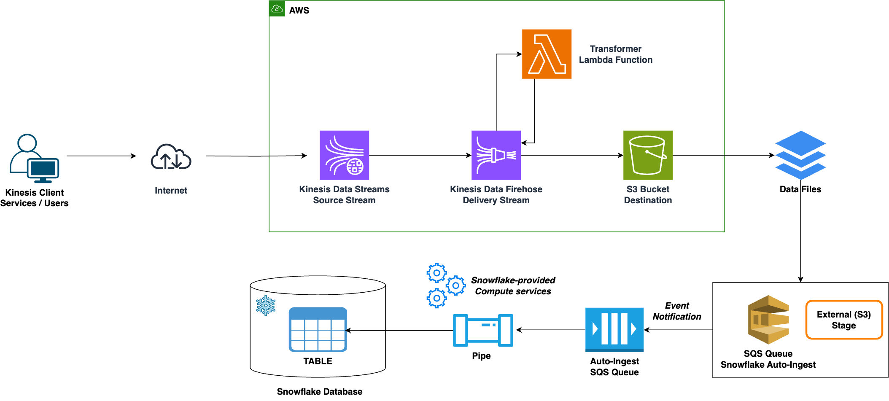

# Data Stream Pipeline

This repository using to create streaming pipeline from:

- AWS Kinesis Data Streams as Source
- AWS Kinesis Data Firehose as Delivery
- AWS Lambda as Transformer
- AWS S3 as Data Lake
- Snowflake as Data Warehouse

Infrastructure is provisioned with the AWS CDK v2.

Data is sent to Kinesis Data Streams by using AWS SDK v3.

*I'm a bit lazy when it comes to creating a Makefile, you can create a Makefile to run shorter bash commands.*

## Init environment file

- `cp .env.example .env`
  - Update `CDK_ACCOUNT` value to your **AWS Account ID**

## Change scripts permission

- `chmod +x ./scripts/*/**/*.sh`

## Update scripts common configuration

- `code ./scripts/config.sh`

## Create AWS IAM user and role for CDK

- `./scripts/create_iam_user_role.sh`

## Deploy CDK with assume the IAM role

- Provision a set of resources AWS CDK
  - `./scripts/cdk.sh bootstrap aws://{aws_account_id}/{aws_region}`
    - Ex: `./scripts/cdk.sh bootstrap aws://911646999666/us-east-1`
- Compare deployed stack with current state
  - `./scripts/cdk.sh diff`
- Deploy this stack
  - `./scripts/cdk.sh deploy --outputs-file ./outputs.json`
    - `outputs.json` is required for this project
- Emits the synthesized CloudFormation template
  - `./scripts/cdk.sh synth`

## Proceduce data to Kinesis Firehose Stream

- `npm run watch` For build and develop source code in Local
- `npm run produce`
  - `npm run produce 1000` to send 1000 records to Kinesis Data Stream

## Load S3 data to Snowflake

- We need create external table and using auto refresh data.
- Follow this [guide](https://docs.snowflake.com/en/user-guide/tables-external-s3). But I automate all things by bash script.
  - Restricting access S3 to VPC ID in your Snowflake account.
    - `./scripts/snowflake/01-allow-vpc-id/restrict_s3_access_to_vpc.sh <vpcId>`
  - Configuring Secure Access to Cloud Storage
    - Creating an IAM Policy
      - `./scripts/snowflake/02-aws-snowflake-s3-access-policy/create.sh`
    - Create the IAM Role in AWS
      - `./scripts/snowflake/03-aws-snowflake-iam-role/create.sh`
      - `./scripts/snowflake/03-aws-snowflake-iam-role/integration.sql` SQL file is auto generated.
        - Follow the instructions in output of `create.sh`
    - Grant the Snowflake IAM User Permissions to Access Bucket Objects
      - `./scripts/snowflake/03-aws-snowflake-iam-role/update.sh <STORAGE_AWS_IAM_USER_ARN> <STORAGE_AWS_EXTERNAL_ID>`
  - Creating a New S3 Event Notification
    - `./scripts/snowflake/04-aws-s3-event-notification/create.sh <notification_channel_arn>`

## References

- [Bulk Loading from Amazon S3](https://docs.snowflake.com/en/user-guide/data-load-s3)
- [Automating Continuous Data Loading Using Cloud Messaging](https://docs.snowflake.com/en/user-guide/data-load-snowpipe-auto)
- [Querying Data in Staged Files](https://docs.snowflake.com/en/user-guide/querying-stage)
- [Refreshing External Tables Automatically for Amazon S3](https://docs.snowflake.com/en/user-guide/tables-external-s3)
